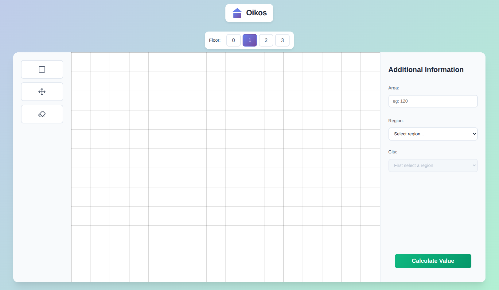
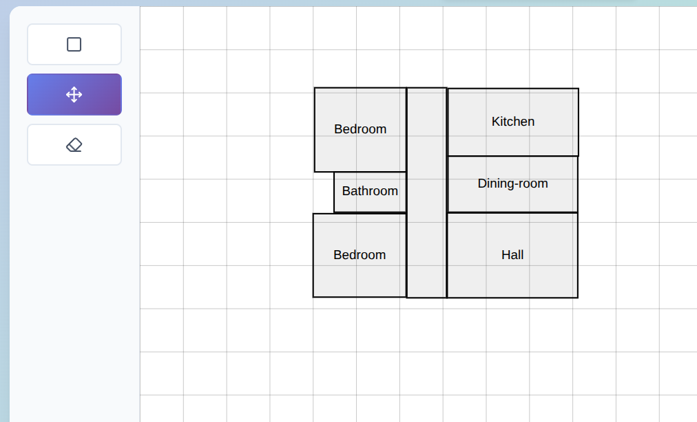
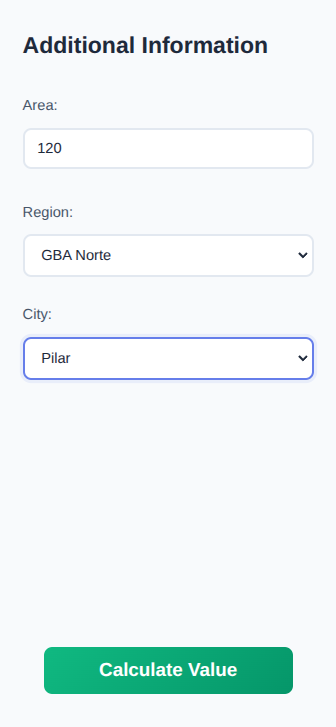
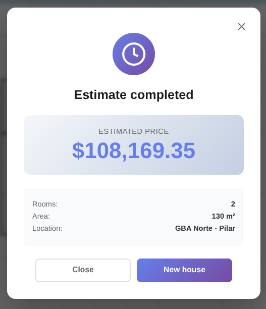

# 🏠 House Price Predictor

Diseña el plano de tu casa y obtén una predicción de precio instantánea usando Machine Learning.

---

## Web Oficial

<https://oikos-hvpr.onrender.com](https://oikos-9jw1.onrender.com/>

## 

---

## ¿Qué hace?

Una aplicación web que te permite dibujar habitaciones interactivamente y predice el precio de la vivienda usando un modelo de Random Forest entrenado con más de 21k propiedades reales.

---

## De donde obtiene los datos?

Obtuve los datos mediante un scraper que puedes encontrar en mi repositorio: <https://github.com/tachyon-lhc/ml-web-sraping>
En el cual scapreo datos de Mercado Libre Inmuebles. En más de 30 localidades de Buenos Aires.

## Cómo usar

1. **Dibuja habitaciones**

2. **Etiqueta cada espacio**

3. Mover, Scalar, Borrar: Habitaciones



1. **Completa los datos** - Área total, características adicionales



1. **Obtén el precio** - Click en "Calcular valor"



## Instalación Local

```bash
# Clonar
git clone https://github.com/tachyon/oikos.git
cd oikos

# Instalar dependencias
python -m venv venv
source venv/bin/activate
pip install -r src/requirements.txt

# Entrenar modelo y correr
python src/app.py
```

---

## Stack Tecnológico

**Frontend:** Vanilla JavaScript, SVG Canvas, CSS3  
**Backend:** Flask, Python  
**ML:** Scikit-learn (Random Forest)  
**Deploy:** Render

---

## Rendimiento del Modelo

- **R² Score:** 0.8 (explica el 80% de la varianza)

---

## Estructura

```
├── src/
│   ├── app.py           # Flask API
│   ├── train_model.py   # Entrenamiento ML
│   └── models/          # Modelo guardado
├── static/              # CSS/JS
├── templates/           # HTML
└── data/               # Dataset
```

---

## Contribuir

Pull requests son bienvenidos. Para cambios grandes, abre un issue primero.
