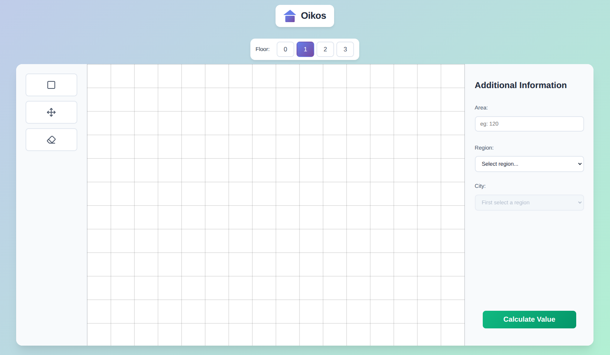
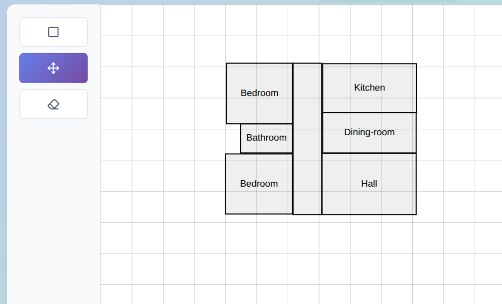
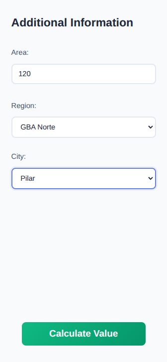
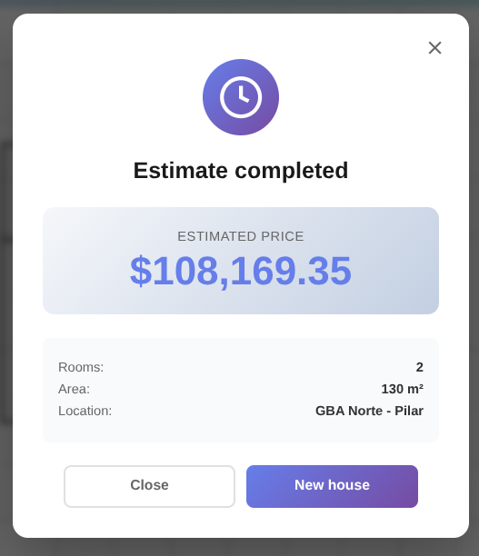

# 🏠 Oikos — House Price Predictor

Design your house floor plan and get an instant price prediction using Machine Learning.

---

## 🔗 Links

|                     |                                                                                                                |
| ------------------- | -------------------------------------------------------------------------------------------------------------- |
| 🌐 Web App          | [oikos-9jw1.onrender.com](https://oikos-9jw1.onrender.com/)                                                    |
| 📊 Market Dashboard | [Looker Studio](https://lookerstudio.google.com/u/0/reporting/aac5fa4f-ba3a-443a-85f6-aade78be0318/page/78DsF) |
| 🔍 Data Exploration | [Streamlit](https://oikos-data-exploration.streamlit.app/)                                                     |

## 📁 Related Repositories

|                     |                                                                |
| ------------------- | -------------------------------------------------------------- |
| 🕷️ Scraper          | [oikos-scraper](https://github.com/tachyon-lhc/ml-web-sraping) |
| 🔍 Data Exploration | [oikos-data-exploration](https://github.com/hadron-lhc/oikos)  |

---

## 

---

## What does it do?

A web application that allows you to draw rooms interactively and predicts the housing price using a Random Forest model trained with over 72k real properties scraped from the Argentine real estate market.

---

## Where does it get the data from?

Data was collected using a custom scraper from Mercado Libre Inmuebles, covering 38 locations across Buenos Aires, Córdoba and the Atlantic Coast.

---

## How to use

1. **Draw rooms** on the interactive canvas
2. **Label each space** (bedroom, kitchen, bathroom, etc.)
3. **Move, scale or delete** rooms as needed



1. **Complete the form** — total area, zone and city



1. **Get the price** — click "Calcular valor"



---

## 🤖 Model Performance

| Metric           | Value   |
| ---------------- | ------- |
| R² Score         | 0.72    |
| MAE              | $59,046 |
| RMSE             | $89,477 |
| Training samples | ~68,000 |

**Top features by importance:**

- Area (63.7%)
- City (12.2%)
- Bathrooms (7.6%)
- Rooms (5.5%)
- Zone (4.6%)

---

## 🛠️ Tech Stack

| Layer    | Technology                           |
| -------- | ------------------------------------ |
| Frontend | Vanilla JavaScript, SVG Canvas, CSS3 |
| Backend  | Flask, Python                        |
| ML       | Scikit-learn (Random Forest)         |
| Data     | SQLite, Pandas                       |
| Deploy   | Render                               |

---

## Local Installation

```bash
# Clone
git clone https://github.com/tachyon-lhc/oikos.git
cd oikos

# Install dependencies
python -m venv venv
source venv/bin/activate
pip install -r src/requirements.txt

# Train model
python src/train_model_v2.py

# Run
python src/app.py
```

---

## 📁 Structure

```
├── src/
│   ├── app.py                # Flask API
│   ├── train_model_v2.py     # ML Training (v2 — 72k properties)
│   ├── analysis_db.py        # Data analysis
│   └── models/               # Saved model + encoders
├── static/                   # CSS/JS
├── templates/                # HTML
├── database/                 # SQLite DB (72k properties)
└── data/                     # Exported CSVs
```

---

## Contributing

Pull requests are welcome. For major changes, please open an issue first.
